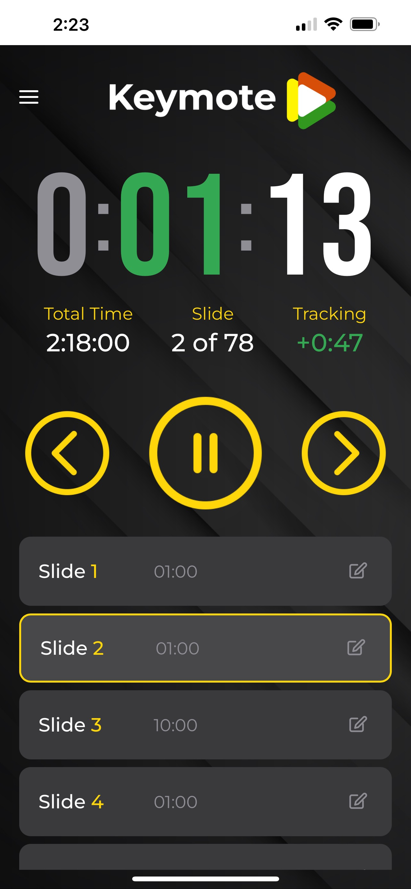

# Keymote - Community Edition

Welcome to the **Community Edition** of Keymote\! This is the open-source core of a powerful tool designed to give you unparalleled control over your Keynote presentations. It features a Flask-based REST API with **real-time slide change detection**, **automatic slide timing management**, and **comprehensive file management** to remotely control Keynote presentations on macOS using AppleScript and WebSocket technology.

This Community Edition is fully functional and provides all the essential features you need for effective presentation timing and control. It is also the foundation for our upcoming **Pro version**, which will offer advanced features for professional presenters, teams, and conferences.



## 📜 License

This project is licensed under the **Apache License 2.0**. You are free to use, modify, and distribute this software. See the LICENSE-2.0.txt file for more details.

## ✨ Features (Community Edition)

  - **🎯 Remote Control**: Control Keynote presentations from any device on your network.
  - **📡 Real-time Monitoring**: Automatically detects manual slide changes in Keynote.
  - **🔄 WebSocket Support**: Live updates with zero polling overhead.
  - **⏱️ Presentation Timer**: Built-in elapsed time tracking with custom slide timing.
  - **📊 Slide Timing Management**: Automatic timing file creation, per-slide updates, and real-time tracking.
  - **📄 JSON Timing Format**: Robust timing files with metadata
  - **💫 Modern UI**: Beautiful, responsive interface with visual feedback.
  - **🚀 Auto-sync**: Slide numbers update dynamically when changed manually in Keynote.
  - **🗂️ File Management**: Browse, open, and list recent Keynote files via API.


## 🚀 Upgrade to Pro (Coming Soon!)

The **Pro version** of Keymote will be a native macOS and iPhone application, offering a seamless user experience and advanced features, including:

  - **🖥️📱 Native macOS and iPhone apps**
  - **🪟 Windows & PowerPoint support**
  - **🤖 AI Slide Timing Analysis**
  - **🗂️ Section-based timing**
  - **🎯 Practice Mode**
  - **🔊 Sound and haptic feedback**
  - **⭐ Slide priority settings**

By using the Community Edition, you are getting a preview of the power and flexibility that Keymote offers. We welcome your feedback and contributions to help make this the best presentation tool available.


## AI Generated Code

In full transparency, most of this app has been "vibe coded" - meaning I have used AI
to generate and test the code. If you want to contribute to the project, there is no
objection to using AI generated code as long as you have thoroughly tested it. Of course,
hand-written code is welcome as well!


## Setup

1.  Install dependencies:

    ```bash
    pip install -r requirements.txt
    ```

2.  Run the server:

    ```bash
    python3 remote.py
    ```

The server will start on `http://0.0.0.0:5050` and be accessible from other devices on your network.

## Slide Timing Features

### Automatic Timing File Creation

When you open a presentation, the system automatically creates a timing file with a default of 1 minute per slide if one doesn't exist:

  - **JSON Format**: Modern `.json` timing files with comprehensive metadata.
  - **Auto-Migration**: Automatically upgrades old `.txt` files to the new JSON format.
  - **PowerPoint Support**: Converts PowerPoint files to Keynote and creates timing files.
  - **Default Timing**: 60 seconds per slide as a starting point.

### Real-time Timing Tracking

  - **Status Indicators**: Visual feedback for timing status (✅ on time, ⚠️ warning, 🔴 over time).
  - **Live Updates**: Real-time progress tracking via WebSocket events.
  - **Comprehensive Stats**: Total planned time, estimated duration, and timing analytics.

### Batch and Per-Slide Timing Updates

  - **Batch Update**: Update timings for multiple slides in a single API call.
  - **Per-Slide Update**: Update timing for a single slide.
  - **Metadata Refresh**: All updates recalculate total/average/custom timings.

### Timing File Format (JSON)

```json
{
  "version": "1.0",
  "formatType": "keynote-timing",
  "presentationInfo": {
    "name": "My Presentation",
    "totalSlides": 10,
    "createdAt": "2024-01-15T10:30:00Z",
    "lastModified": "2024-01-15T10:30:00Z"
  },
  "slideTimings": {
    "1": {
      "plannedTime": 60.0,
      "notes": "",
      "description": "Slide 1",
      "importance": "normal"
    }
  },
  "metadata": {
    "totalPlannedTime": 600.0,
    "estimatedDuration": "10m 0s",
    "slidesWithCustomTiming": 0,
    "averageTimePerSlide": 60.0
  }
}
```

### PowerPoint Integration

  - **Auto-Detection**: Automatically detects PowerPoint imports in Keynote.
  - **Seamless Conversion**: Converts `.ppt`/`.pptx` files to `.key` format.
  - **File Organization**: Saves converted files in the same directory as the originals.
  - **Timing Creation**: Creates JSON timing files for converted presentations.
  - **Manual Conversion Endpoint**: Convert an open PowerPoint to Keynote via an API call.

## File Management Features

  - **Recent Files**: List recently accessed Keynote and PowerPoint files.
  - **File Browser**: Browse directories for presentation files.
  - **Open File**: Open a specific Keynote or PowerPoint file in Keynote via an API call.

## Real-time Presentation Timer

### Timer Display Features

The application includes a real-time presentation timer with intelligent color-coding and tracking features:

#### Large Digital Clock

  - **HH:MM:SS Format**: Shows elapsed presentation time in large, easy-to-read digits.
  - **Real-time Updates**: Updates every second during active presentations.
  - **Automatic Control**: Starts/stops/pauses with presentation state changes.

#### Color-Coded Time Display

The timer uses dynamic color-coding to provide visual feedback on presentation progress:

**Hours Display:**

  - 🔸 **Gray**: When hours = 0 (presentation under 1 hour).
  - 🔴 **Red**: When hours \> 0 (indicating a long presentation).

**Minutes Display:**

  - 🟢 **Green**: On time - Less than 60 seconds behind schedule, or ahead of schedule.
  - 🟡 **Yellow**: Losing progress - 60 seconds to 2 minutes behind schedule.
  - 🔴 **Red**: Off track - More than 2 minutes behind schedule.

**Seconds Display:**

  - ⚪ **White**: Always white for consistent readability.

**Labels (h/m/s):**

  - Match their corresponding digit colors for visual consistency.

#### Tracking Display

Shows a real-time comparison against the planned timing:

**Format**: `+/-MM:SS` (e.g., `+2:15` = 2 minutes and 15 seconds ahead, `-1:30` = 1 minute and 30 seconds behind).

**Color Coding:**

  - 🟢 **Green**: On time - Less than 60 seconds behind schedule, or ahead of schedule.
  - 🟡 **Orange**: Losing progress - 60 seconds to 2 minutes behind schedule.
  - 🔴 **Red**: Off track - More than 2 minutes behind schedule.

**Calculation Method:**

  - Compares elapsed time vs. the expected time to reach the current slide.
  - Updates dynamically as you progress through the slides.
  - Accounts for custom slide timings from the timing files.

#### Timer Controls

  - **Automatic Start**: The timer starts when the presentation begins.
  - **Pause/Resume**: The timer pauses when the presentation is paused.
  - **Reset**: The timer resets when opening a new presentation.
  - **State Persistence**: Maintains timing across pause/resume cycles.

#### Information Panel

  - **Current Slide**: Shows the active slide number.
  - **Total Slides**: Shows the total length of the presentation.
  - **Total Time**: Shows the total planned duration of the presentation (static).
  - **Tracking**: Shows real-time adherence to the schedule (dynamic).

### Timer Integration

The timer seamlessly integrates with all presentation controls:

  - **Play/Pause Button**: Controls both the presentation and the timer.
  - **WebSocket Events**: The timer responds to remote state changes.
  - **Slide Navigation**: Tracking updates when the slides change.
  - **Manual Controls**: Works with keyboard shortcuts and Keynote controls.

## API Endpoints

### Core Presentation Control

  - `GET /next_slide` - Move to the next slide.
  - `GET /previous_slide` - Move to the previous slide.
  - `GET /current_slide_number` - Get the current slide number.
  - `GET /total_slides` - Get the total number of slides in the presentation.
  - `GET /presentation_info` - Get both the current slide and the total slides in one call.
  - `GET /goto_slide/<slide_number>` - Navigate to a specific slide number.
  - `GET /start_presentation` - Start the slideshow (auto-enables monitoring).
  - `GET /stop_presentation` - Stop the slideshow (auto-disables monitoring).

### Real-time Monitoring

  - `POST /monitoring/start` - Start background slide monitoring.
  - `POST /monitoring/stop` - Stop background slide monitoring.
  - `GET /monitoring/status` - Get the current monitoring status.

### Slide Timing Management

  - `POST /slide_timings/load` - Manually reload the timing file.
  - `GET /slide_timings/status` - Get a comprehensive timing status for all slides.
  - `GET /slide_timings/slide/<slide_number>` - Get timing information for a specific slide.
  - `GET /slide_timings/metadata` - Get comprehensive timing statistics.
  - `POST /slide_timings/create_default` - Create a default timing file for the current presentation.
  - `GET /slide_timer_stats` - Get slide timer statistics with timing information.
  - `PUT/POST /slide_timings/update/<slide_number>` - Update the planned timing for a specific slide.
  - `PUT/POST /slide_timings/batch_update` - Batch update timings for multiple slides (see below).

### File Management

  - `GET /files/recent_keynote_files` - List recently accessed Keynote and PowerPoint files.
  - `GET /files/browse?path=<dir>` - Browse files and directories for presentations.
  - `POST /files/open_keynote` - Open a specific Keynote or PowerPoint file in Keynote.

### PowerPoint Conversion

  - `POST /powerpoint/convert_to_keynote` - Convert the currently open PowerPoint to Keynote and create a timing file.

### Debug & Troubleshooting

  - `GET /debug_timing` - Debug the timing file and presentation state (HTML UI).
  - `GET /debug/timing_creation` - Debug endpoint for timing file creation status (JSON).

### Additional Presentation Timing

  - `GET /presentation/total_planned_time` - Get the total planned time for the current presentation.
  - `GET /presentation/timing_status` - Get the overall timing status for the presentation.

### WebSocket Events

  - `slide_changed` - Emitted when the slide number changes (includes timing info).
  - `slide_timing_update` - Emitted when a slide is completed with timing data.
  - `slide_timings_batch_updated` - Emitted when batch timings are updated.
  - `current_slide_timing` - Periodic updates for the active slide timing.
  - `monitoring_status` - Emitted when the monitoring state changes.
  - `connect`/`disconnect` - Connection status events.

## Usage

Make sure you have a Keynote presentation open before using the API endpoints. The API will return appropriate error messages if no document is open.

### REST API Examples:

```bash
curl http://your-mac-ip:5050/next_slide
curl http://your-mac-ip:5050/current_slide_number
curl http://your-mac-ip:5050/goto_slide/5
curl -X POST http://your-mac-ip:5050/monitoring/start
curl -X POST http://your-mac-ip:5050/slide_timings/create_default
curl http://your-mac-ip:5050/slide_timings/metadata
curl -X PUT -H 'Content-Type: application/json' -d '{"plannedTime":90}' http://your-mac-ip:5050/slide_timings/update/3
curl -X PUT -H 'Content-Type: application/json' -d '{"slideTimings":{"1":60,"2":90}}' http://your-mac-ip:5050/slide_timings/batch_update
curl http://your-mac-ip:5050/files/recent_keynote_files
curl -X POST -H 'Content-Type: application/json' -d '{"filePath":"/path/to/file.key"}' http://your-mac-ip:5050/files/open_keynote
curl -X POST http://your-mac-ip:5050/powerpoint/convert_to_keynote
```

### WebSocket Usage:

```javascript
const socket = io('http://your-mac-ip:5050');

socket.on('slide_changed', (data) => {
    console.log(`Slide changed to: ${data.slideNumber}`);
    if (data.timingStatus) {
        console.log(`Timing: ${data.timingStatus.status}`);
    }
});

socket.on('slide_timing_update', (data) => {
    const status = data.timingStatus;
    console.log(`Slide ${data.slideNumber}: ${status.actualTime}s (planned: ${status.plannedTime}s) - ${status.status}`);
});

socket.on('slide_timings_batch_updated', (data) => {
    console.log('Batch timings updated:', data);
});

socket.emit('start_monitoring');
```

## Response Format

### Current Slide Number:

```json
{
  "status": "success",
  "slideNumber": 5
}
```

### Total Slides:

```json
{
  "status": "success",
  "totalSlides": 77
}
```

### Presentation Info:

```json
{
  "status": "success",
  "currentSlide": 32,
  "totalSlides": 77
}
```

### Slide Navigation:

```json
{
  "status": "success",
  "message": "Navigated to slide 5.",
  "targetSlide": 5
}
```

### Timing Status:

```json
{
  "status": "success",
  "currentSlide": 3,
  "currentTiming": {
    "hasPlannedTime": true,
    "plannedTime": 60,
    "actualTime": 23.4,
    "status": "on_time",
    "variance": -36.6,
    "percentageUsed": 39.0
  },
  "completedTimings": {
    "1": { "plannedTime": 30, "actualTime": 32.1, "status": "over_time" },
    "2": { "plannedTime": 45, "actualTime": 47.8, "status": "over_time" }
  },
  "presentationRunning": true,
  "timingFilePath": "/path/to/presentation.json"
}
```

### Timing Metadata:

```json
{
  "status": "success",
  "metadata": {
    "totalPlannedTime": 600.0,
    "estimatedDuration": "10m 0s",
    "slidesWithCustomTiming": 0,
    "averageTimePerSlide": 60.0,
    "presentationName": "My Presentation",
    "totalSlides": 10,
    "createdAt": "2024-01-15T10:30:00Z"
  }
}
```

### Monitoring Status:

```json
{
  "status": "success",
  "active": true,
  "currentSlide": 3,
  "lastCheck": 1635789123.456,
  "interval": 2.0
}
```

### WebSocket Slide Change Event:

```json
{
  "slideNumber": 5,
  "totalSlides": 77,
  "previousSlide": 4,
  "timestamp": 1635789123.456,
  "slideTimerReset": true,
  "presentationRunning": true,
  "timingStatus": {
    "hasPlannedTime": true,
    "plannedTime": 30,
    "actualTime": 0,
    "status": "on_time",
    "variance": -30,
    "percentageUsed": 0
  }
}
```

### WebSocket Timing Update Event:

```json
{
  "slideNumber": 3,
  "timingStatus": {
    "hasPlannedTime": true,
    "plannedTime": 60,
    "actualTime": 65.2,
    "status": "over_time",
    "variance": 5.2,
    "percentageUsed": 108.7
  },
  "timestamp": 1699123456.789
}
```

### Error Response:

```json
{
  "status": "error",
  "message": "No Keynote document open."
}
```

## How It Works

### Background Monitoring

The server runs a background thread that polls Keynote every 2 seconds to detect slide changes. When a change is detected:

1.  **Detection**: AppleScript queries Keynote for the current slide number.
2.  **Comparison**: The server compares it with the previously known slide number.
3.  **Timing Calculation**: It updates the slide timing data and calculates the status.
4.  **Broadcasting**: It emits a WebSocket event to all connected clients with the timing info.
5.  **UI Update**: The frontend receives the event and updates the display with an animation.

### Smart Activation

  - Monitoring automatically starts when you begin a presentation.
  - Monitoring stops when the presentation ends.
  - Manual control is available via a UI toggle or API endpoints.
  - It gracefully falls back to polling mode if WebSocket is unavailable.

### Timing Management

  - **Auto-Creation**: Creates timing files when presentations are opened.
  - **Migration**: Automatically upgrades old text files to the JSON format.
  - **Real-time Tracking**: Tracks actual vs. planned timing during presentations.
  - **Status Calculation**: Provides visual feedback on timing performance.

## Usage Tips

1.  **File Management**: Timing files are automatically created and managed.
2.  **PowerPoint Support**: Simply open PowerPoint files in Keynote—conversion is automatic.
3.  **Version Control**: Consider versioning your timing files alongside your presentations.
4.  **Real-time Feedback**: Use WebSocket events to build real-time timing dashboards.
5.  **Flexible Timing**: Edit the JSON timing files to customize slide durations and metadata.

## Recent Changes

  - **v5.1**: Added batch slide timing updates, file Browse/opening, recent files, PowerPoint conversion endpoint, and debug endpoints.
  - **v5.0**: Added comprehensive slide timing management with the JSON format.
  - **v4.5**: Implemented PowerPoint auto-conversion and timing file creation.
  - **v4.2**: Added automatic timing file migration and metadata support.
  - **v4.1**: Enhanced timing tracking with real-time status indicators.
  - **v4.0**: Added real-time slide change detection with WebSocket support.
  - **v3.2**: Enhanced the UI with monitoring indicators and visual feedback.
  - **v3.1**: Added the `goto_slide/<slide_number>` endpoint for direct slide navigation.
  - **v3.0**: Simplified the API by removing the complex `get_current_slide_info` endpoint.

## Requirements

  - macOS with Keynote installed
  - Python 3.7+
  - Flask 3.0+
  - Flask-SocketIO 5.3+
  - Network connectivity between devices

## Troubleshooting

### Timing Issues

  - **No timing loaded**: Check that the presentation is open and the timing file exists.
  - **PowerPoint conversion**: Ensure PowerPoint files are properly imported into Keynote.
  - **File permissions**: Verify write permissions in the presentation directory.
  - **Format errors**: Use the debug interface at `/debug_timing` or `/debug/timing_creation` to diagnose issues.

### File Issues

  - **Cannot find file**: Use `/files/browse` or `/files/recent_keynote_files` to locate and open files.
  - **File not opening**: Ensure the file is a valid `.key`, `.ppt`, or `.pptx` file and is accessible.

### General Issues

  - **Connection problems**: Check network connectivity and firewall settings.
  - **Keynote not responding**: Restart Keynote and ensure a presentation is open.
  - **WebSocket issues**: Check the browser console for connection errors.